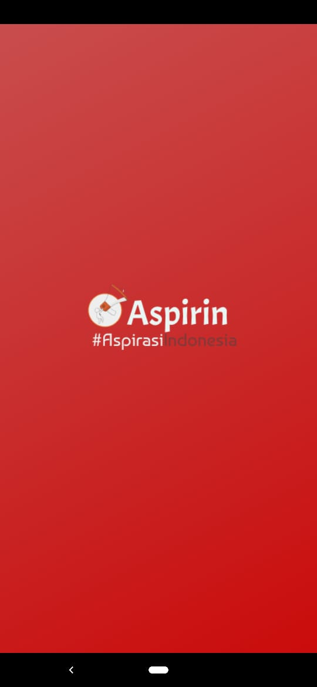
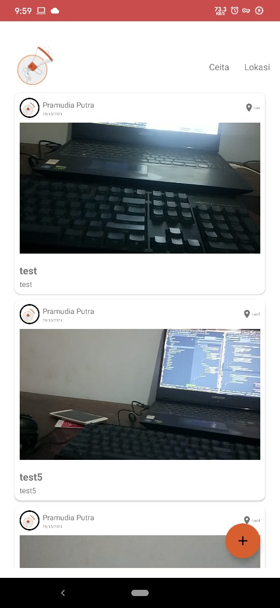

# Aspirin #AspirasiIndonesia

Sebuah karya dari:
- Pramudia Putra Pamungkas (6706192015) (PramudiaPutra)
- Akhdan Pangestuaji Widodo (6706190008) (akhdanpangestuajiwidodo)
- Cahya Aulia S.E.P (6706190088) (cahyaauliasep)

Aspirin merupakan aplikasi berbasis Android di bidang lingkungan dan sosial.
Aplikasi ini memiliki tujuan untuk memberi kesadaran terhadap masyarakat tentang
kepedulian keadaan di sekitar, sehingga masyarakat dapat berpartisipasi dalam
menyampaikan aspirasi guna berkontribusi kepada lingkungan sekitarnya.

. Adapun fitur dari aplikasi ini yaitu:
- Register + Cahya Aulia
- Login + Pramudia Putra
- Cerita + Akhdan Pangestuaji
- Lokasi + Pramudia Putra
- Membuat Postingan + Akhdan Pangestuaji
- Setting Aplikasi + Cahya Aulia

Screenshot aplikasi :
|Tampilan Splashscreen                         | Tampilan Register                                | Tampilan Login                               |
|----------------------------------------------|--------------------------------------------------|----------------------------------------------|
||  |  |                                             |

|Tampilan Cerita                               | Tampilan Kamera                              | Tampilan Membuat Postingan                    |
|----------------------------------------------|----------------------------------------------|-----------------------------------------------|
||  ||                                            |                                              |                                               |

Link Google Drive (APK + Video Demo): https://drive.google.com/drive/folders/1D-qpLACMkJeoa7l1JEd9o4NEdCSfXqLQ?usp=sharing
